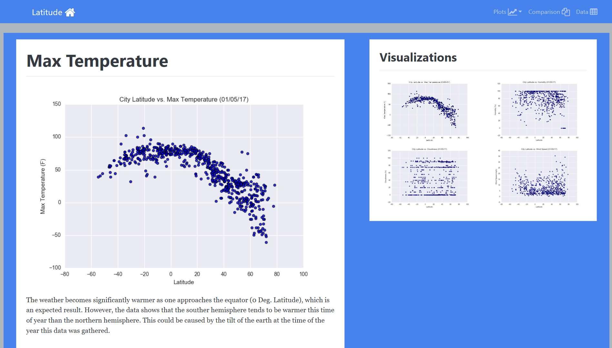
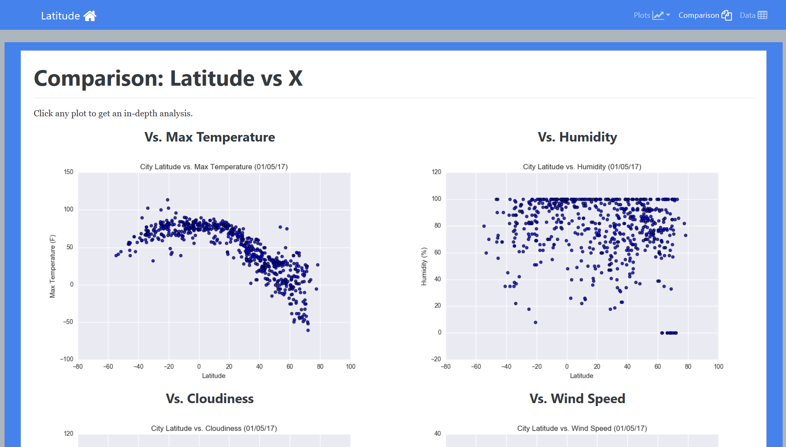
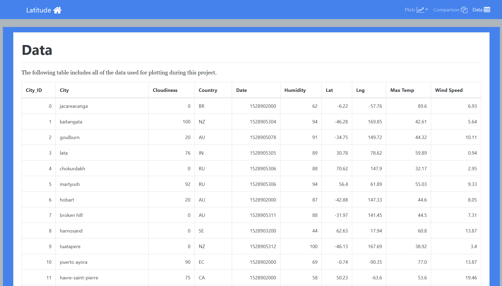

In this project, a website using HTML, CSS, and Bootstrap 4.3.1 was developed to display weather data and visualizations created as part of an analysis on how weather changes 
as you get closer to the equator. Weather data was pulled from the OpenWeatherMap API to assemble a dataset on over 500 cities. After assembling the dataset, 
Matplotlib was used to plot various aspects of the weather vs. latitude. Factors that were investigated in this analysis included: temperature, cloudliness, 
wind speed, and humidity. The website also provides explanations and descriptions of any trends and correlations witnessed.

## Weather Analysis Website
https://orlcar.github.io/html-weather-analysis/

### Summary Webpage

### Plots (Max Temperature) Webpage

### Comparison Webpage

### Data Webpage
